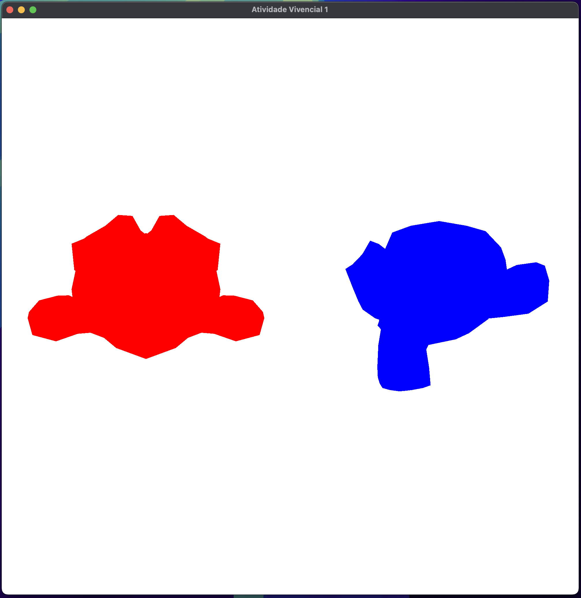

# Vivencial 1

## Visão Geral

Este projeto demonstra como criar e gerenciar múltiplas entidades 3D em um contexto OpenGL. Cada entidade pode ser controlada individualmente, permitindo transformações como escala e rotação. O código utiliza GLFW para criação de janelas e GLAD para carregar funções OpenGL. GLM é usado para operações matemáticas envolvendo matrizes e vetores.

## Funcionalidades

- **Gerenciamento de Múltiplas Entidades:** Suporta a instanciação e renderização de múltiplas entidades 3D dentro de uma única cena.

- **Transformações Independentes:** Cada entidade pode ter suas próprias propriedades de escala, rotação e cor.

- **Controles Interativos:** Use entradas do teclado para manipular atributos da entidade selecionada, como escala, rotação e alternância de seleção.

## Dependências

- **GLFW:** Biblioteca para gerenciar janelas, contextos e entrada.
- **GLAD:** Gerador de carregador OpenGL usado para gerenciar ponteiros de função.
- **GLM:** Biblioteca matemática para OpenGL, suporta operações de matriz e vetor.

## Guia de Início

### Pré-requisitos

Certifique-se de ter as seguintes bibliotecas instaladas:
- GLFW
- GLAD
- GLM

### Instruções de Compilação

1. **Clone o Repositório**
   ```sh
   git clone <link_do_repositorio>
   cd <nome_do_repositorio>
   ```

2. **Setup do Projeto**
   👉 [Getting Started - CGCCHibrido](https://github.com/fellowsheep/CGCCHibrido/blob/main/GettingStarted.md)

3. **Execute o Executável**
   ```sh
   ./OpenGLDemo
   ```

## Uso

### Controles de Teclado

- **Transformações:**
  - Tecla `[`: Diminui a escala da entidade selecionada.
  - Tecla `]`: Aumenta a escala da entidade selecionada.
  - Tecla `X`: Alterna rotação ao redor do eixo X para a entidade selecionada.
  - Tecla `Y`: Alterna rotação ao redor do eixo Y para a entidade selecionada.
  - Tecla `Z`: Alterna rotação ao redor do eixo Z para a entidade selecionada.

- **Seleção de Entidade:**
  - Tecla `A`: Seleciona a entidade anterior.
  - Tecla `D`: Seleciona a próxima entidade.

- **Gerenciamento de Janela:**
  - Tecla `Esc`: Fecha a janela e termina o programa.

### Configuração

- **Propriedades da Entidade:**
  - As entidades são definidas com posição, cor, escala e caminho para um arquivo de modelo OBJ.
  - A cor e a escala inicial são especificadas durante a instanciação da entidade no código.

## Exemplo de Configuração

```cpp
entities.emplace_back(0.0f, 0.0f, 0.0f, glm::vec3(1.0f, 0.0f, 0.0f), 1.0f, "path/to/model1.obj");
entities.emplace_back(0.5f, 0.0f, 0.5f, glm::vec3(0.0f, 0.0f, 1.0f), 0.5f, "path/to/model2.obj");
```

